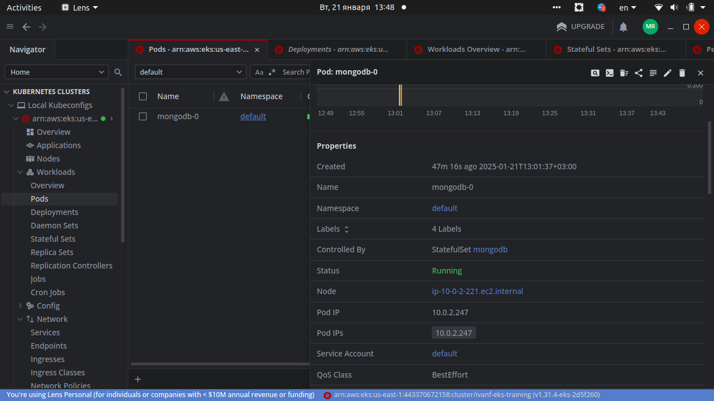

# IBA devops training

## HW19. Deploy a mongodb in EKS using appropriate POD type

To deploy MongoDB in Kubernetes on AWS EKS (Elastic Kubernetes Service), we can use StatefulSet as MongoDB requires Persistent Storage to store data and will need specific identifiers for each node.
MongoDB will use Persistent Volume to store data. PV and PVC description must be created.
A service with clusterIP: None allows you to connect to MongoDB by DNS name, taking into account the replicas in the StatefulSet. 
For example, a MongoDB replica will be available at mongodb-0.mongodb, mongodb-1.mongodb, etc.

Update kubectl config to use EKS cluster

```bash
aws eks --region <region> update-kubeconfig --name <eks-cluster-name>

sudo aws eks --region us-east-1 update-kubeconfig     --name ivanf-eks-training

```

### Manifests

[mongopv.yaml](https://github.com/voyager1122/iba_hw19/blob/main/mongopv.yaml)

[mongodb-statefulset.yaml](https://github.com/voyager1122/iba_hw19/blob/main/mongodb-statefulset.yaml)

[mongodb-service.yaml](https://github.com/voyager1122/iba_hw19/blob/main/mongodb-service.yaml)

#### Apply

```bash
sudo kubectl apply -f mongopv.yaml
sudo kubectl apply -f mongodb-statefulset.yaml
sudo kubectl apply -f mongodb-service.yaml

```

Result:

```bash
sudo kubectl get pods
NAME        READY   STATUS    RESTARTS   AGE
mongodb-0   1/1     Running   0          36m

sudo kubectl get pvc
NAME                     STATUS   VOLUME       CAPACITY   ACCESS MODES   STORAGECLASS   VOLUMEATTRIBUTESCLASS   AGE
mongodb-data-mongodb-0   Bound    mongodb-pv   10Gi       RWO            gp2            <unset>                 36m

sudo kubectl get svc
NAME         TYPE        CLUSTER-IP   EXTERNAL-IP   PORT(S)     AGE
kubernetes   ClusterIP   172.20.0.1   <none>        443/TCP     141m
mongodb      ClusterIP   None         <none>        27017/TCP   113m
```

Connect to mongodb:

```bash
sudo kubectl exec mongodb-0 -it -- /bin/bash

root@mongodb-0:/# mongosh
Current Mongosh Log ID:	678f79e584a41a862fe94969
Connecting to:		mongodb://127.0.0.1:27017/?directConnection=true&serverSelectionTimeoutMS=2000&appName=mongosh+2.3.4
Using MongoDB:		8.0.4
Using Mongosh:		2.3.4

For mongosh info see: https://www.mongodb.com/docs/mongodb-shell/


test> use test
switched to db test
test> db.createCollection("sampledata")
{ ok: 1 }
test> show dbs
admin   40.00 KiB
config  12.00 KiB
local   40.00 KiB
test     8.00 KiB


```

### Lens installation

```bash
sudo snap install kontena-lens --classic
```


